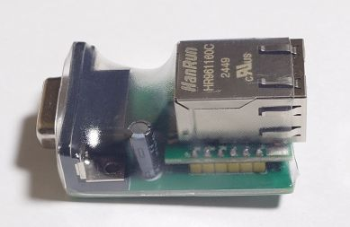
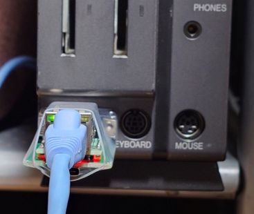
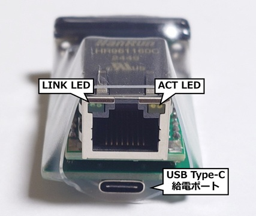

# X680x0 ネットワークアダプタ「イーサネットじょい君」ドキュメント

## 概要

「イーサネットじょい君」はX680x0のジョイスティックポートに接続するネットワークアダプタです。
専用ドライバ joynetd.x を使用することで、X680x0にイーサネット接続機能を追加できます
(通信速度はあまり速くありません)。

計測技研製TCP/IPドライバ(inetd.x)互換のAPIを提供しているため、inetd.xに対応するネットワークアプリケーションをイーサネットじょい君でも動作させることができます。



## セットアップ手順

### 「イーサーネットじょい君」の接続

「イーサネットじょい君」をX680x0のジョイスティックポートに接続し、LANケーブルでルーターやハブに接続してください。
ジョイスティックポートは 1 と 2 のどちらに接続しても構いません。

X680x0 に電源を入れると、LANケーブルが正しく接続されていてルーター等に繋がっていればLANコネクタのLINK LED(緑)が点灯し、パケットのやり取りでACT LED(黄)が点滅するはずです。



もしLINK LED(緑)が点灯でなく点滅している場合は、ジョイスティックポートからの供給電力不足で起動に失敗している状態です。「イーサネットじょい君」を挿し直しても改善しない場合は、外部からの電源供給が必要となります。
下部の USB Type-C コネクタにUSB電源アダプタを接続して電源を供給してください。



### ソフトウェアのインストール

「イーサネットじょい君」の使用には本ドライバ `joynetd.x` と計測技研TCP/IPドライバ [TCPPACKA](http://retropc.net/x68000/software/internet/kg/tcppacka/) が必要です。
PCなどでダウンロードしたアーカイブを X680x0 環境に転送して展開してください。

- `joynetd.x`、`joynetd.cfg` は、パスの通った適当なディレクトリに配置します。
- TCPPACKA は、bin ディレクトリのネットワーク関連コマンドと etc ディレクトリが最低限必要です。
  - bin ディレクトリ内のコマンドはパスの通った適当なディレクトリに配置します
  - etc ディレクトリの内容は、inetd.x と同様に適当なパスにディレクトリごとコピーして環境変数 `SYSROOT` にそのパスを指定するか、または etc ディレクトリ内のファイルを `joynetd.x` と同じディレクトリにコピーしてください
    - 詳細は TCPPACKA 内のドキュメント man/inetd.8 「ETC directoryの決定」を参照してください

### CONFIG.SYS の編集

joynetd.x 自体はバックグラウンドプロセスを使用しませんが、inetd.x がバックグラウンドプロセスを利用していたためにネットワーク対応アプリにはこの設定が前提になっているものが存在します。

CONFIG.SYS に以下の行を追加して再起動し、バックグラウンドプロセスを有効にしてください。

```
process = 3 10 10
```

### ネットワーク設定

joynetd.x は inetd.x とは異なり、設定ファイル `joynetd.cfg` を使用してネットワーク設定を行います
(ifconfig や inetdconf などのコマンドは joynetd.x では使用できません)。

設定ファイルを joynetd.x と同じディレクトリに配置して、使用する環境に応じて内容を編集してください。

```
mac=02:03:04:05:06:07
ip=192.168.1.100
mask=255.255.255.0
gw=192.168.1.1
dns=192.168.1.1
```

#### `mac`: MACアドレス

MACアドレスはネットワーク上の機器を識別するための48ビット(6バイト)の値で、16進数を8ビットごとにコロンで区切って表記します。

通常、このアドレスはネットワーク機器の製造時に一意に割り当てられますが、イーサネットじょい君で使用しているネットワークコントローラ [W5500](https://wiznet.io/products/ethernet-chips/w5500) はMACアドレスを内蔵していないため、ユーザが任意のMACアドレスを設定する必要があります。
同一ネットワーク上の他の機器と重複しないような値を設定してください。

#### `ip`: IPアドレス

「イーサネットじょい君」に割り当てるIPアドレスを指定します。

#### `mask`: サブネットマスク

「イーサネットじょい君」を接続するネットワークで使用しているサブネットマスクを指定します。

#### `gw`: デフォルトゲートウェイ

「イーサネットじょい君」を接続するネットワークのデフォルトゲートウェイのIPアドレスを指定します
(通常はルーターのIPアドレスになります)。

#### `dns`: DNSサーバ

「イーサネットじょい君」を接続するネットワークのDNSサーバのIPアドレスを指定します
(通常はルーターのIPアドレスになります)。

### joynetd.x の実行

ネットワークを有効にするために joynetd.x を実行します。
joynetd.x は以下のコマンドラインオプションを指定できます。

```
使用法: joynetd [-r] [-p|-j<port number>] [-t<trap number>]
  -r       常駐解除
  -p|-j    使用するジョイスティックポート番号 (1 or 2) (default: 1)
  -t       APIのtrap番号 (0～7)
```

起動してイーサネットじょい君を認識すると、
```
X680x0 Ethernet Joy-kun Network driver (version xxxxxxxx)
MAC: xx;xx:xx:xx:xx:xx
IP: xxx.xxx.xxx.xxx
netmask: xxx.xxx.xxx.xxx
gateway: xxx.xxx.xxx.xxx
DNS: xxx.xxx.xxx.xxx
joynetd が常駐しました
```
のように表示されてドライバが常駐し、TCP/IPアプリケーションが利用可能になります。

```
イーサネットじょい君が接続されていません
```
と表示された場合は、ジョイスティックポートにイーサネットじょい君が正しく接続されているか、電源供給が正常に行われているかを確認してください。

### 接続確認

joynetd が常駐できたら、ネットワークの接続を確認してみましょう。
以下のコマンドを実行します。

```
ping www.google.com
```

イーサネットじょい君がルーターを介してインターネットに接続されていて、joynetd.cfg で正しくネットワーク設定が出来ていれば、ping に対して以下のように応答があるはずです
(CTRL+C で 中止できます)。

```
PING www.google.com (xxx.xxx.xxx.xxx): 56 data bytes
64 bytes from xxx.xxx.xxx.xxx: icmp_seq=0 time=xx ms
64 bytes from xxx.xxx.xxx.xxx: icmp_seq=1 time=xx ms
64 bytes from xxx.xxx.xxx.xxx: icmp_seq=2 time=xx ms
    :
```

もし応答がない場合は、LANケーブルの接続や joynetd.cfg の設定内容を確認してみてください。

## 動作確認済みアプリケーション

以下のネットワークアプリケーションの動作を確認しています

- TCPPACKA 付属のコマンド
  - ping, telnet
- [smbfs, smbclient](https://github.com/yunkya2/smbfs-x68k)
- [httpsget](https://github.com/yunkya2/httpsget)
- [WebXpressionPlus](https://github.com/yunkya2/WebXpressionPlus)

使用方法は各コマンドのドキュメントを参照してください。


## 未対応機能

現バージョンでは、inetd.x の以下の機能には対応していません。

- ネットワーク設定関連の以下のコマンド (ネットワーク設定には joynetd.cfg を使用します)
  - arp, ifconfig, inetdconf, netstat
- TCPPACKA 付属のライブラリの以下の機能
  - libether.a の機能すべて
  - libnetwokr.a の以下のAPI
    - ARP関連すべて (search_arp_table(), delete_arp_table()など)
    - iface関連すべて (get_iface_list(), iface_lookup()など)
    - route関連すべて (rt_top(), rt_lookup()など)
    - 以下のdomain関連API
      - dns_add(),dns_drop(),dns_get()
- ループバックインターフェース (lo0: 127.0.0.1)

## ジョイスティックポートの利用について

joynetd.x が常駐している間はジョイスティックポートの状態を取得する IOCS _JOYGET がフックされ、「イーサネットじょい君」を接続しているポートのジョイスティック情報は常に $ff となります。

接続していない方のジョイスティックポートは、ネットワークアクセス中でなければ通常通り使用できます。

## 免責事項

「イーサネットじょい君」およびドライバ joynetd.x は無保証です。

利用者が「イーサネットじょい君」およびドライバ joynetd.x を使用した結果、いかなるトラブルが発生した場合であっても、作者は一切の責任を負わないものとします。個人の責任において使用してください。

## ライセンス

Copyright (c) 2026 Yuichi Nakamura (@yunkya2)

joynetd.x のソースコードには、(株) 計測技研 が開発したフリーソフトウェアとして
http://retropc.net/x68000/software/internet/kg/tcppackb/
にて無償配布されている「TCP/IPドライバ無償配布パッケージ(B PACK)」に含まれる以下のソースコードを使用しています。
- tcpipdrv.h

その他の、作者が新たに作成したソースコードは MIT ライセンスとします。
