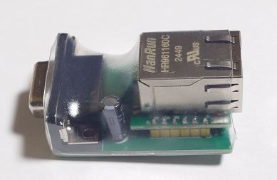
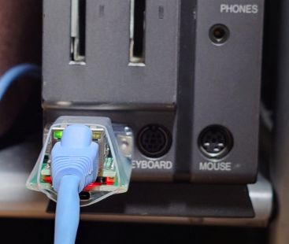
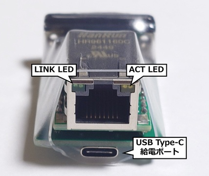

# X680x0 ネットワークアダプタ「イーサネットじょい君」ドキュメント

## 概要

「イーサネットじょい君」はX680x0のジョイスティックポートに接続するネットワークアダプタです。
専用ドライバ joynetd.x を使用することで、X680x0にイーサネット接続機能を追加できます
(通信速度はあまり速くありません)。

計測技研製TCP/IPドライバ(inetd.x)互換のAPIを提供しているため、inetd.xに対応するネットワークアプリケーションをイーサネットじょい君でも動作させることができます。




## セットアップ手順

### 「イーサーネットじょい君」の接続

「イーサネットじょい君」をX680x0のジョイスティックポートに接続し、LANケーブルでルーターやハブに接続してください。
ジョイスティックポートは 1 と 2 のどちらに接続しても構いません。

X680x0 に電源を入れると、LANケーブルが正しく接続されていてルーター等に繋がっていればLANコネクタのLINK LED(緑)が点灯し、パケットのやり取りでACT LED(黄)が点滅するはずです。



もしLINK LED(緑)が点灯でなく点滅している場合は、ジョイスティックポートからの供給電力不足で起動に失敗している状態です。「イーサネットじょい君」を挿し直しても改善しない場合は、外部からの電源供給が必要となります。
下部の USB Type-C コネクタにUSB電源アダプタを接続して電源を供給してください。



### ソフトウェアのインストール

「イーサネットじょい君」の動作にはドライバ `joynetd.x` が必要です。
PCなどで [Releases](https://github.com/yunkya2/joynetd/releases) ページから最新ドライバのアーカイブをダウンロードし、X680x0 環境に転送して展開してください。

`joynetd.x` は、パスの通った適当なディレクトリに配置してください。

### CONFIG.SYS の編集

joynetd.x 自体はバックグラウンドプロセスを使用しませんが、inetd.x がバックグラウンドプロセスを利用していたためにネットワーク対応アプリにはこの設定が前提になっているものが存在します。

CONFIG.SYS に以下の行を追加して再起動し、バックグラウンドプロセスを有効にしてください。

```
process = 8 10 10
```

### joynetd.x の実行

ネットワークを有効にするために joynetd.x を実行します。

初回起動では設定ファイルが存在しないため、`-c` オプションを付けて起動して設定ファイルを作成します。
この際、`-j` オプションで「イーサネットじょい君」を接続しているジョイスティックポート番号を指定してください。

```
joynetd -c -j<ポート番号>
```

設定ファイルは、joynetd.x と同じディレクトリに `joynetd.cfg` という名前で作成されます。
その後、「イーサネットじょい君」の接続を認識するとネットワーク設定を DHCP で取得します。

一連の設定に成功すると、以下のようなメッセージが表示されて joynetd.x が常駐します。
```
X680x0 Ethernet Joy-kun Network driver (version xxxxxxxx)
設定ファイルを生成しました
ネットワーク設定をDHCPで取得しています...
DHCPリースの取得に成功しました
Interface : en0                 MAC addr: xx:xx:;xx:xx:xx:xx
IP addr : xxx.xxx.xxx.xxx       Netmask : xxx.xxx.xxx.xxx
Gateway : xxx.xxx.xxx.xxx       DNS     : xxx.xxx.xxx.xxx
joynetd が常駐しました
```

もしここで、
```
ポート x にイーサネットじょい君が接続されていません
```
と表示された場合は、指定したジョイスティックポートにイーサネットじょい君が正しく接続されているか、電源供給が正常に行われているかを確認してください。

また、接続しているネットワークにDHCPサーバが存在しない場合は、ネットワーク設定を手動で行う必要があります。
joynetd.cfg を編集して設定を行ってください。

二回目以降、既に joynetd.cfg が作成された状態であれば、オプションを付けずに `joynetd` を実行するだけでネットワークが有効になります。
常駐解除は `joynetd -r` で行います。
「イーサネットじょい君」を初回起動と異なるジョイスティックポートに接続する場合は、`-j` オプションでポート番号を指定するか joynetd.cfg の `port` 設定を書き換えてください。

### 計測技研 TCP/IP ドライバのインストール

計測技研のTCP/IPドライバ [TCPPACKA](http://retropc.net/x68000/software/internet/kg/tcppacka/) にはネットワーク関連コマンドやライブラリ、etc ディレクトリのテンプレートが含まれているため、これらをインストールします。

- bin ディレクトリ内のコマンドは、パスの通った適当なディレクトリに配置します
- etc ディレクトリ内のファイル `hosts`, `networks`, `protocols`, `services` は、joynetd.x が起動時に参照します。以下のいずれかの方法で配置してください
  - etc ディレクトリごと任意のパスに配置し、環境変数 `SYSROOT` で、etc ディレクトリが存在するパスを指定する
  - etc ディレクトリ内のファイルを `joynetd.x` と同じディレクトリにコピーする
- その他のディレクトリ、`include`, `lib` は、ネットワークアプリケーションの開発時に必要に応じて使用してください

### 接続確認

設定が完了して joynetd.x が常駐すると、TCP/IPアプリケーションがネットワークを利用できるようになります。

計測技研ドライバに含まれる ping.x を用いて接続確認を行ってみます。以下のコマンドを実行します。

```
ping www.google.com
```

イーサネットじょい君がルーターを介してインターネットに接続されていて正しくネットワーク設定が出来ていれば、ping に対して以下のように応答があるはずです
(CTRL+C で 中止できます)。

```
PING www.google.com (xxx.xxx.xxx.xxx): 56 data bytes
64 bytes from xxx.xxx.xxx.xxx: icmp_seq=0 time=xx ms
64 bytes from xxx.xxx.xxx.xxx: icmp_seq=1 time=xx ms
64 bytes from xxx.xxx.xxx.xxx: icmp_seq=2 time=xx ms
    :
```

もし応答がない場合は、LANケーブルの接続や joynetd.cfg の設定内容を確認してみてください。


## コマンドラインオプション

joynetd.x は以下のコマンドラインオプションをサポートしています。

- `-j <port number>`: ジョイスティックポート番号を指定する
  - 「イーサネットじょい君」を接続するジョイスティックポート番号を 1 または 2 の数値で指定します
- `-r`: 常駐解除
  - 常駐している joynetd.x を常駐解除します
- `-c`: 設定ファイルを生成する
  - joynetd.cfg が存在しない場合に、デフォルトの設定ファイルを生成します
  - 既に joynetd.cfg が存在する場合はエラーになります。再生成が必要な場合は既存のファイルを削除してからこのオプションを使用してください
- `-v`: 詳細表示
  - DHCP による設定時などに、より詳細な情報を表示します
- `-f <config file>`: 設定ファイルのパスを指定する
  - デフォルトでは joynetd.x と同じディレクトリにある `joynetd.cfg` を使用しますが、このオプションで任意のパスにある設定ファイルを指定できます
- `-t <trap number>`: APIのtrap番号を指定する
  - ネットワークアプリケーションが joynetd.x のAPIを呼び出す際に使用するtrap番号を指定します
  - 0～7 の数値で trap #0～#7 を指定できます。-1 を指定すると trap 命令を使用せずにAPI呼び出しを行います。-2 を指定すると、未使用のtrap番号を自動的に割り当てます(デフォルト)
  - 通常は自動割り当てで問題ありませんが、他のドライバ等との兼ね合いで特定のtrap番号を使用したい場合に指定してください
- `-i <interface name>`: 使用するネットワークインターフェース名を指定する
  - ifconfig コマンドなどで使用するネットワークインターフェース名を指定します
  - デフォルトは `en0` になります
- `-d <dhcp mode>`: DHCP使用モードを指定する
  - 起動時に DHCP サーバからネットワーク設定を自動的に取得するかどうかを指定します
  - デフォルトは `-d1` で DHCP を使用します
  - `-d0` を指定すると DHCP を使用しません。IPアドレスなどのネットワーク設定は joynetd.cfg 内か、ifconfig, inetdconf コマンドを用いて手動で行う必要があります
- `-h <host name>`: DHCP使用時のホスト名を指定する
  - DHCP クライアントが DHCP サーバに対して送信するホスト名を指定します
  - デフォルトはホスト名なしの状態になります
  - ホスト名を指定すると、DHCP サーバが対応していればその名前が DNS に登録されます
  - 他のホストからそのホスト名での名前解決が可能かどうかは、OSやネットワーク設定に依存します


## 設定ファイル joynetd.cfg について

joynetd.x の設定項目は設定ファイル `joynetd.cfg` に保存されます。
joynetd.cfg で設定できる項目は以下の通りです。

- `mac`: MACアドレス
  - MACアドレスはネットワーク上の機器を識別するための48ビット(6バイト)の値で、16進数を8ビットごとにコロンで区切って表記します。
  - 通常、MACアドレスはネットワーク機器の製造時に一意に割り当てられますが、イーサネットじょい君で使用しているネットワークコントローラ [W5500](https://wiznet.io/products/ethernet-chips/w5500) はMACアドレスを内蔵していないため、joynetd.x が `-c` オプションで設定ファイルを生成する際にランダムに生成したアドレスを使用します。
  - もし同一ネットワーク上の他の機器と重複するなどの不都合がある場合は、この項目を変更して重複しないアドレスを指定してください。

以下の項目は、コマンドラインオプションと同様に「イーサネットじょい君」接続に関する設定を行います。
コマンドラインオプションが指定された場合は、joynetd.cfg の設定よりも優先されます。

- `port`: ジョイスティックポート番号
- `trap`: APIが使用するtrap番号
- `ifname`: ネットワークインターフェース名
- `dhcp`: DHCP使用モード
- `hostname`: ホスト名

以下の項目は、ネットワーク接続に関する設定を行います。DHCPで設定を取得する場合は設定不要です。

- `ip`: IPアドレス
- `mask`: サブネットマスク
- `gw`: デフォルトゲートウェイ
- `dns`: DNSサーバ
- `domain`: ドメイン名

DHCP による設定取得も joynetd.cfg によるネットワーク設定も行わない場合は、MAC アドレスのみが設定された状態で常駐します。
この場合は、常駐後に TCPPACKA 付属の ifconfig コマンドや inetdconf コマンドを使用することでネットワーク設定を行うことができます。


## 動作確認済みアプリケーション

以下のネットワークアプリケーションの動作を確認しています

- TCPPACKA 付属のコマンド
  - ifconfig, inetdconf, netstat, ping, telnet
- [smbfs, smbclient](https://github.com/yunkya2/smbfs-x68k)
- [httpsget](https://github.com/yunkya2/httpsget)
- [WebXpressionPlus](https://github.com/yunkya2/WebXpressionPlus)
- [netcat](https://github.com/yunkya2/netcat-x68k)
- [wget](https://github.com/yunkya2/wget-x68k)
- [idhcpc](https://github.com/68fpjc/idhcpc)

使用方法は各コマンドのドキュメントを参照してください。


## 未対応機能

現在のバージョンの joynetd.x 内蔵のDHCPクライアントは、取得したIPアドレスのリース期間の管理を行っていません。また、常駐解除時にリースの解放も行いません。

joynetd.x は inetd.x の以下の機能には対応していません。

- ネットワーク設定関連の以下のコマンド
  - arp コマンド
  - netstat コマンドによる統計情報表示
- TCPPACKA 付属ライブラリの以下の機能
  - libether.a の機能すべて
  - libnetwokr.a のARP関連API (search_arp_table(), delete_arp_table()など)
- ループバックインターフェース (lo0: 127.0.0.1)


## ジョイスティックポートの利用について

joynetd.x が常駐すると、「イーサネットじょい君」との通信のためにジョイスティックポートの 8255 の入出力モードを切り替えます。このため、同様に 8255 のモードを切り替える「MMCじょい君」「白窓君」(TNB製作所さん作) などとは共存できません。
デバイスの故障の可能性があるため、「イーサネットじょい君」使用中にこれらを別のポートに同時に接続したり、これらのドライバを動作させたりすることのないようにご注意ください。

接続に特別なアダプタ等の必要ない 2 ボタンまでのシンプルなジョイスティックであれば、「イーサネットじょい君」や joynetd.x との併用は可能です。
ネットワークアクセス中でなければ、接続していない方のジョイスティックポートは通常通り使用できます。

joynetd.x が常駐している間はジョイスティックポートの状態を取得する IOCS _JOYGET がフックされ、「イーサネットじょい君」を接続しているポートのジョイスティック情報は常に $ff となります。


## 免責事項

「イーサネットじょい君」およびドライバ joynetd.x は無保証です。

利用者が「イーサネットじょい君」およびドライバ joynetd.x を使用した結果、いかなるトラブルが発生した場合であっても、作者は一切の責任を負わないものとします。個人の責任において使用してください。


## 謝辞

joynetd 内の DHCP クライアント機能の実装には、68fpjc さんが開発された [インチキ DHCP クライアント idhcpc](https://github.com/68fpjc/idhcpc) のソースコードを利用させていただきました。ありがとうございます。


## ライセンス

Copyright (c) 2026 Yuichi Nakamura (@yunkya2)

joynetd.x のソースコードには、(株) 計測技研 が開発したフリーソフトウェアとして
http://retropc.net/x68000/software/internet/kg/tcppackb/
にて無償配布されている「TCP/IPドライバ無償配布パッケージ(B PACK)」に含まれる以下のソースコードを使用しています。
- tcpipdrv.h
- network.h

idhcpc ディレクトリ内のソースコードは 0BSD ライセンスです。

その他の、作者が新たに作成したソースコードは MIT ライセンスとします。
